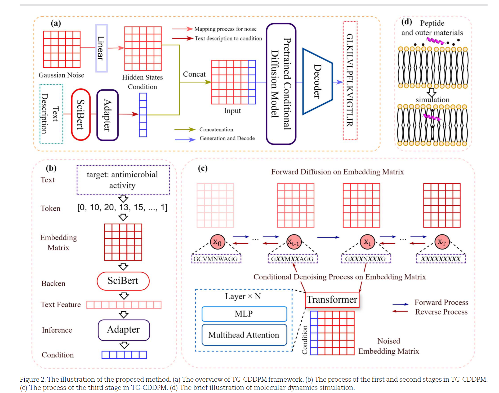
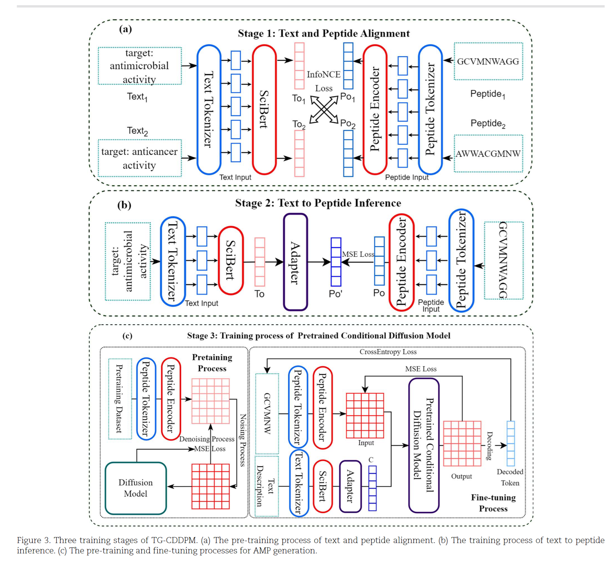
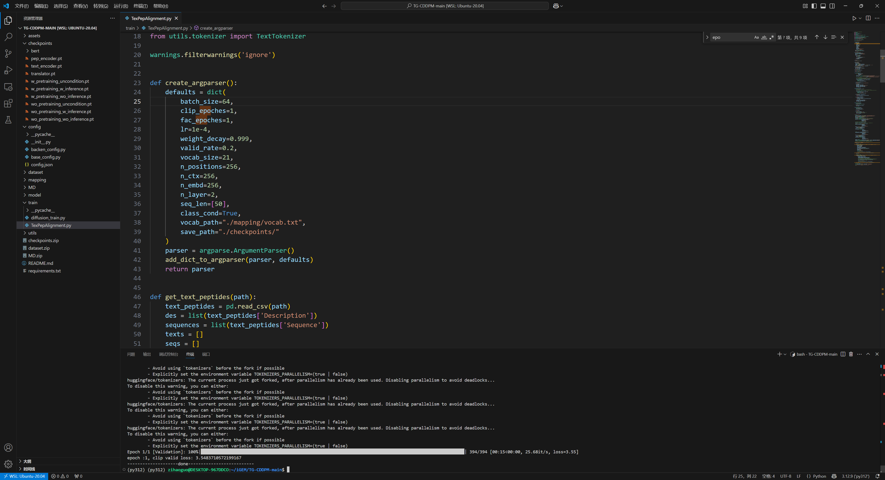
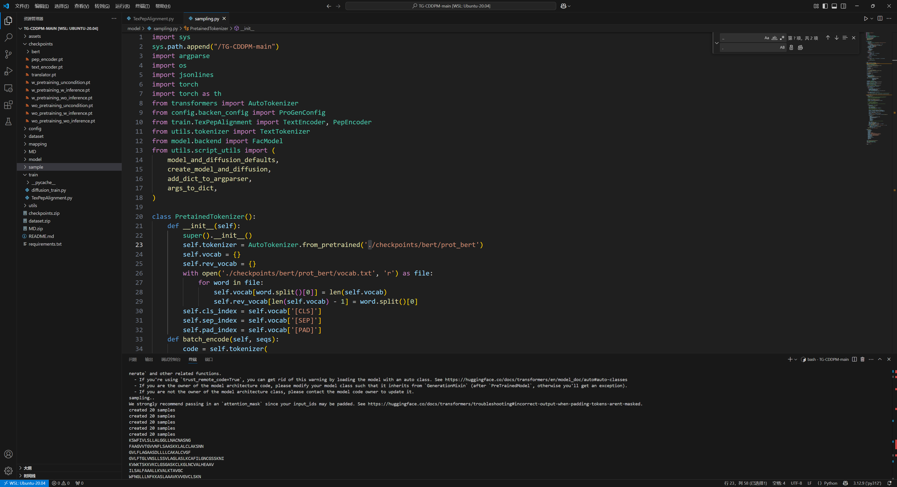

# TG-CDDPM复现指南


原GitHub连接 https://github.com/JunhangCao/TG-CDDPM

原论文连接 https://academic.oup.com/bib/article/26/1/bbae644/7922577

TG-CDDPM: text-guided antimicrobial peptides generation based on conditional denoising diffusion probabilistic model

好的，我已经将您提供的 `README.md` 文件与原作者的指南结合，并进行了润色、补充和重新排版，使其更具条理性和可读性。

------

# TG-CDDPM 复现指南 🧬

## 简介

本项目旨在复现论文 **TG-CDDPM: text-guided antimicrobial peptides generation based on conditional denoising diffusion probabilistic model** 的结果。TG-CDDPM 是一个基于条件去噪扩散概率模型的文本引导抗菌肽生成框架。

- **原始论文**: https://academic.oup.com/bib/article/26/1/bbae644/7922577
- **原始代码**: https://github.com/JunhangCao/TG-CDDPM

### 模型结构

## 模型结构图






------

## 复现步骤

### 1. 环境准备

首先，克隆原始代码仓库，并根据 `requirements.txt` 文件安装所需依赖。

Bash

```
git clone https://github.com/JunhangCao/TG-CDDPM.git
cd TG-CDDPM
pip install -r requirements.txt
```

### 2. 数据与预训练模型

从以下链接下载所需的数据集和预训练模型，并将其解压到项目根目录。

- **下载链接**: [Google Drive](https://drive.google.com/drive/folders/1aN3cScePnxq368pL6ymeKFj8EFenPBj0?usp=drive_link)

### 3. 模型训练 (可选)

如果您想从头开始完整训练整个框架，请遵循以下三个阶段。如果您只想进行采样生成，可以跳过此步骤。

#### **阶段一：文本-肽对齐 (Text-Peptide Alignment)**

此阶段用于对齐文本和肽序列的特征表示。

运行结果

python -m train.TexPepAlignment




#### **阶段二：训练Adapter**

此阶段为扩散模型训练一个Adapter。

1. 修改代码：

   调整 utils/train_utils.py 中的 forward_backward 函数和 gaussian_diffusion.py 中的损失函数。

   - 在 `utils/train_utils.py` 的 `forward_backward` 函数中:

     Python

     ```
     def forward_backward():  
         ...  
         if k == 'input_ids':  
             micro_cond[k] = v[i: i + self.microbatch].to(self.device)
         ...
     ```

   - 在 `gaussian_diffusion.py` 的 `training_losses_seq2seq` 函数中:

     Python

     ```
     def training_losses_seq2seq(self, model, x_start, t, model_kwargs=None, noise=None):  
         ...  
         terms["loss"] = terms["mse"]  
         ...
     ```

   

#### **阶段三：文本引导的DDPM微调**

此阶段使用预训练的DDPM检查点进行文本引导的微调。

1. 修改代码：

   再次调整 utils/train_utils.py 中的 forward_backward 函数和 gaussian_diffusion.py 中的损失函数。

   - 在 `utils/train_utils.py` 的 `forward_backward` 函数中:

     Python

     ```
     def forward_backward():  
         ...  
         if k == 'input_ids':  
             micro_cond[k] = v[i: i + self.microbatch].to(self.device)
         else:  
             with torch.no_grad():  
                 text_features = self.text_encoder(v[i: i + self.microbatch].to(self.device)) 
                 text_features_norm = text_features / text_features.norm(dim=-1,keepdim=True) 
                 text_features_norm = text_features_norm.unsqueeze(1).repeat(1, 50, 1)  
                 timesteps = torch.tensor([0] * text_features.shape[0], device=self.device)  
                 fac_text_z = self.facilitator(inputs_embeds=text_features_norm,timesteps=timesteps)  
                 fac_text_z_norm = fac_text_z / fac_text_z.norm(dim=-1, keepdim=True)  
                 micro_cond['self_condition'] = text_features_norm
     ```

   - 在 `gaussian_diffusion.py` 的 `training_losses_seq2seq` 函数中:

     Python

     ```
     def training_losses_seq2seq(self, model, x_start, t, model_kwargs=None, noise=None):  
        ...
        terms["loss"] = terms["mse"] + decoder_nll
        ...
     ```

2. **开始训练**：

   Bash

   ```
   cd train
   python diffusion_train.py
   ```


### 4. 肽序列生成 (Sampling)

python -m model.sampling --num_samples 100




## 分子动力学模拟 (可选)

论文中对生成的肽进行了分子动力学(MD)模拟以验证其结构稳定性。以下是复现该过程的简要步骤。

1. 3D结构预测:

   使用 AlphaFold 2 预测生成肽的3D结构。可以利用其Colab笔记本：

   - https://colab.research.google.com/github/sokrypton/ColabFold/blob/main/AlphaFold2.ipynb
   - 保存预测得分最高的二级结构为 `.pdb` 文件。

2. MD模拟准备:

   使用 CHARMM-gui 准备力场、温度和压力等模拟所需文件：

   - https://www.charmm-gui.org/

3. GROMACS模拟:

   使用 GROMACS 运行100ns的MD模拟。以下是在Linux系统中的示例命令：

   Bash

   ```
   # 创建并进入运行目录
   mkdir {path}/run
   cd {path}/run
   
   # 拷贝GROMACS输入文件
   cp {path}/gromacs/step5_input.gro .       
   cp {path}/gromacs/step5_input.pdb .        
   cp {path}/gromacs/topol.top .        
   cp {path}/gromacs/index.ndx .           
   cp -r {path}/gromacs/toppar .
   
   # 步骤1: 能量最小化
   gmx grompp -f step6.0_minimization.mdp -o minimization.tpr -c step5_input.gro -r step5_input.gro -p topol.top
   gmx mdrun -v -deffnm minimization
   
   # 步骤2-7: 平衡步骤 (共6步)
   gmx grompp -f step6.1_equilibration.mdp -o step6.1_equilibration.tpr -c minimization.gro -r step5_input.gro -p topol.top -n index.ndx
   gmx mdrun -v -deffnm step6.1_equilibration
   # ... (重复执行 step6.2 到 step6.6) ...
   
   # 步骤8: 生产模拟 (Production MD)
   gmx grompp -f step7_production.mdp -o step7_production.tpr -c step6.6_equilibration.gro -t step6.6_equilibration.cpt -p topol.top -n index.ndx
   # 注意：可通过修改 step7_production.mdp 中的 dt 和 nsteps 来调整模拟时长 (dt * nsteps = time ps)
   gmx mdrun -s step7_production -cpi
   ```

   模拟完成后，将生成轨迹文件 `traj.trr`，可用于后续分析。


