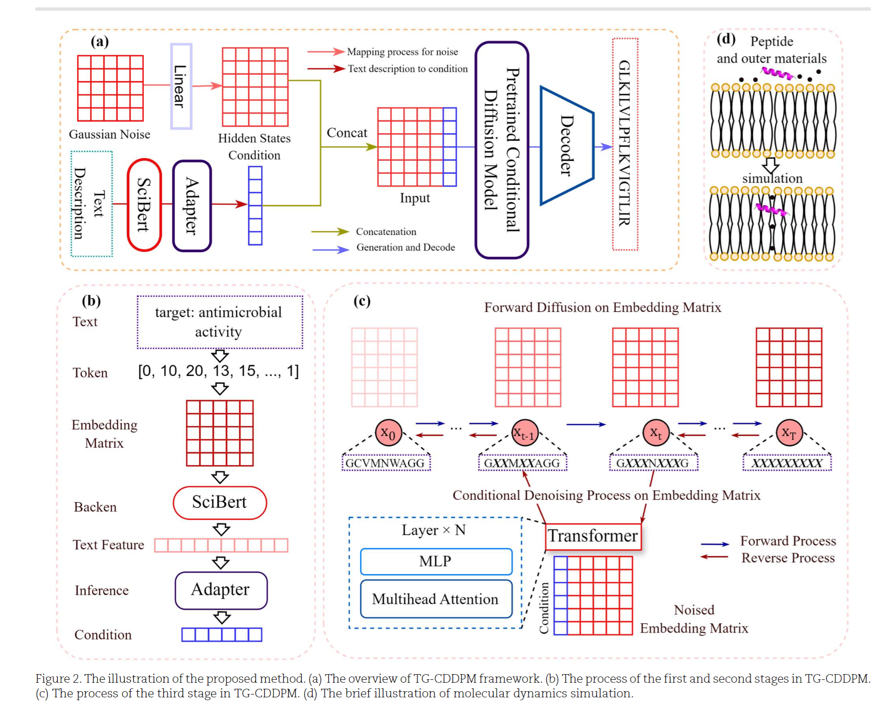
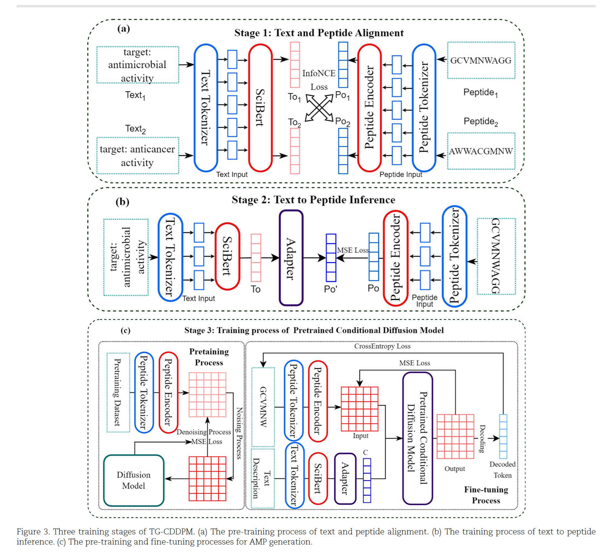

# TG-CDDPM复现指南

原GitHub连接 https://github.com/JunhangCao/TG-CDDPM

原论文连接 https://academic.oup.com/bib/article/26/1/bbae644/7922577

TG-CDDPM: text-guided antimicrobial peptides generation based on conditional denoising diffusion probabilistic model

## 模型结构图

运行结果

