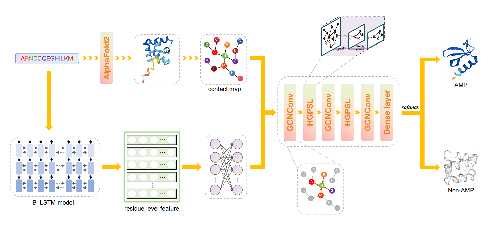

# deepAMPNet：论文复现指南

本项目实现了 deepAMPNet，一个基于图神经网络的模型，用于识别和分类抗菌肽（Antimicrobial Peptides, AMPs）。模型通过结合肽序列的上下文特征与三维结构的空间信息，构建图结构数据，并利用分层图池化网络进行学习和预测。

本指南旨在帮助研究者复现该论文的核心成果。

模型结构图

<p align="center">
	 
</p>  


## 1. 环境配置

请遵循以下步骤配置运行环境。

### 1.1. 创建虚拟环境 (推荐)

建议使用 Conda 创建一个独立的 Python 环境，以避免包版本冲突。

Bash

```
conda create -n deepampnet python=3.12
conda activate deepampnet
```

### 1.2. 安装依赖库

项目所需的依赖库已在 `requirements.txt` 文件中列出。请使用 pip进行安装。

Bash

```
pip install -r requirements.txt
```

### 1.3. 下载预训练语言模型

本项目使用预训练的 Bi-LSTM 蛋白质语言模型来提取氨基酸序列特征。

1. 请从[此链接](http://bergerlab-downloads.csail.mit.edu/prose/saved_models.zip)下载预训练模型文件。
2. 解压下载的 `saved_models.zip` 文件。
3. 将名为 `prose_mt_3x1024.sav` 的模型文件拷贝到项目根目录下的 `Bi_LSTM_model/` 文件夹中。

## 2. 数据准备

模型的输入并非原始的 FASTA 或 PDB 文件，而是经过预处理的图数据格式。请按照以下两个步骤生成所需的数据集。

### 2.1. 步骤一：提取序列特征

此步骤利用预训练的 Bi-LSTM 模型，为 FASTA 文件中的每个氨基酸生成特征向量，并保存为 H5 文件。

Bash

```
# -i: 输入的FASTA文件
# -o: 输出的H5文件名
# -n: 特征维度 (必须与模型定义一致)
# -d: Bi-LSTM方向 (-1代表双向)
python encode_AA.py -i example/example.fasta -o example/example.h5 -n 6165 -d -1
```

### 2.2. 步骤二：构建图数据集

此步骤结合上一步生成的 H5 文件（作为节点特征）和 PDB 文件（用于构建图的边），生成 PyTorch Geometric 格式的数据集。

Bash

```
# --pdb: PDB文件所在的目录
# --label: 阳性样本列表文件 (可选)
# --h5: 上一步生成的H5文件
# --threshold: 构建边的距离阈值 (埃)
# --root: 生成的最终数据集的存放目录
python dataset_h5.py --pdb example/example_pdb --label example/AMPs.txt --h5 example/example.h5 --threshold 20 --root example/dataset_example
```

执行完毕后，`example/dataset_example/processed/` 目录下会生成一个 `.dataset` 文件，这便是模型可以直接使用的数据。

## 3. 模型训练

您可以使用 `train.py` 脚本来训练模型。请确保您已经按照第 2 节的方法准备好了训练和测试数据集。

### 3.1. 训练命令示例

Bash

```
python train.py --batch_size 64 \
                --epochs 100 \
                --learning_rate 0.0005 \
                --train_dataset <your_train_dataset_path> \
                --test_dataset <your_test_dataset_path> \
                --net HGPSL \
                --save HGPSL_output
```

### 3.2. 训练参数说明

| **参数**          | **说明**                                                     |
| ----------------- | ------------------------------------------------------------ |
| `--batch_size`    | 训练时的批次大小。                                           |
| `--epochs`        | 训练的总轮数。                                               |
| `--learning_rate` | 学习率。                                                     |
| `--train_dataset` | **训练数据集**的路径（即第 2.2 步中 `--root` 指定的路径）。  |
| `--test_dataset`  | **测试数据集**的路径。                                       |
| `--save`          | 保存输出结果的路径前缀。                                     |
| `--net`           | 选择模型架构，可选 `GCN`, `GAT`, 或 `HGPSL`。                |
| `--dropout`       | 模型中 Dropout 的比率。                                      |
| `--num_features`  | 输入节点特征的维度，必须与 `encode_AA.py` 中的 `-n` 参数一致。 |
| `--hidden_dim`    | 模型隐藏层的维度。                                           |
| `--pool_ratio`    | HGPSL 模型中的池化比率。                                     |
| `--lamb`          | HGPSL 模型中的权衡参数。                                     |
| ...               | 其他参数请使用 `python train.py -h` 查看。                   |

## 4. 模型测试与预测

使用 `test.py` 脚本和训练好的模型权重，可以对新的数据进行抗菌肽识别。

### 4.1. 测试命令示例

以下命令将使用我们提供的预训练模型 `saved_model/deepAMPNet.pth` 对示例数据进行测试。

Bash

```
python test.py --batch_size 32 \
               --test_dataset data/test_data \
               --pdb_dir example/example_pdb \
               --h5_file example/example.h5 \
               --model saved_model/deepAMPNet.pth \
               --prefix out
```

**注意**: 如果 `data/test_data/processed/` 目录下的数据集文件不存在，脚本会自动调用数据准备流程，此时必须提供 `--pdb_dir` 和 `--h5_file` 参数。

### 4.2. 测试参数说明

| **参数**         | **说明**                                   |
| ---------------- | ------------------------------------------ |
| `--batch_size`   | 测试时的批次大小。                         |
| `--test_dataset` | 测试数据集的路径。                         |
| `--pdb_dir`      | （仅在需要自动生成数据集时）PDB 文件目录。 |
| `--h5_file`      | （仅在需要自动生成数据集时）H5 特征文件。  |
| `--model`        | **已训练好的模型权重文件**的路径。         |
| `--prefix`       | 输出 CSV 文件的名称前缀。                  |

## 5. 复现结果

成功运行测试命令后，您将得到两份输出：

1. 一个名为 `out.csv` 的文件，其中包含对每个测试样本的预测类别和概率。
2. 在终端打印出的总体性能指标。

### 5.1. 终端输出示例

```
acc: 0.7 
auc: 0.8300000000000001 
precision: 1.0 
recall: 0.4 
F1-score: 0.5714285714285714 
mcc: 0.5 
Sn: 0.4 
Sp: 1.0
```

### 5.2. 关键指标说明

- **acc (Accuracy)**: 准确率，模型正确预测的样本占总样本的比例。
- **auc (Area Under Curve)**: ROC 曲线下的面积，综合衡量模型性能。
- **Sn (Sensitivity / Recall)**: 灵敏度或召回率，模型正确识别出所有真实阳性样本的能力。
- **Sp (Specificity)**: 特异度，模型正确识别出所有真实阴性样本的能力。

------
