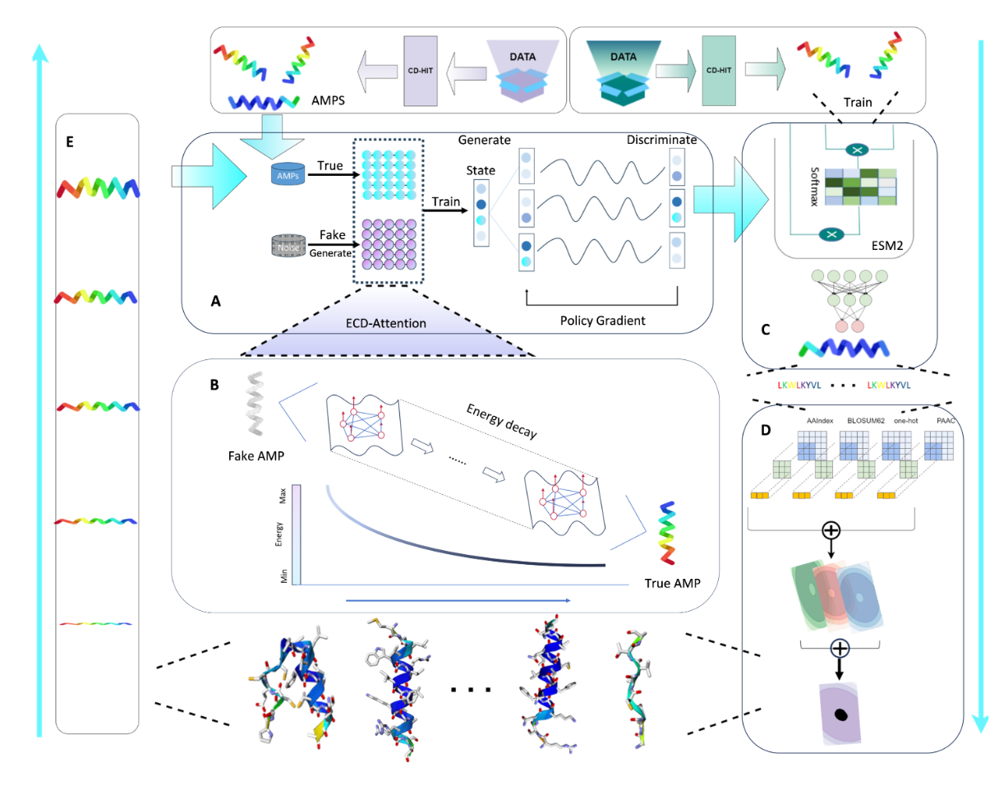
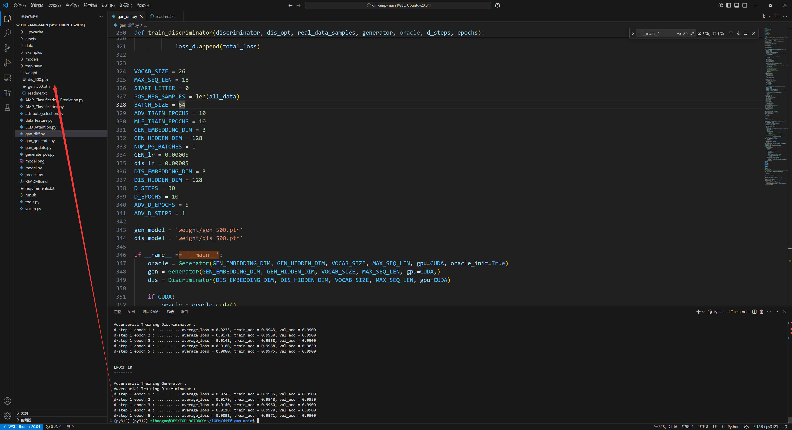
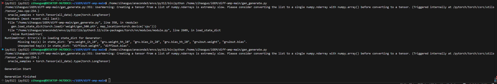
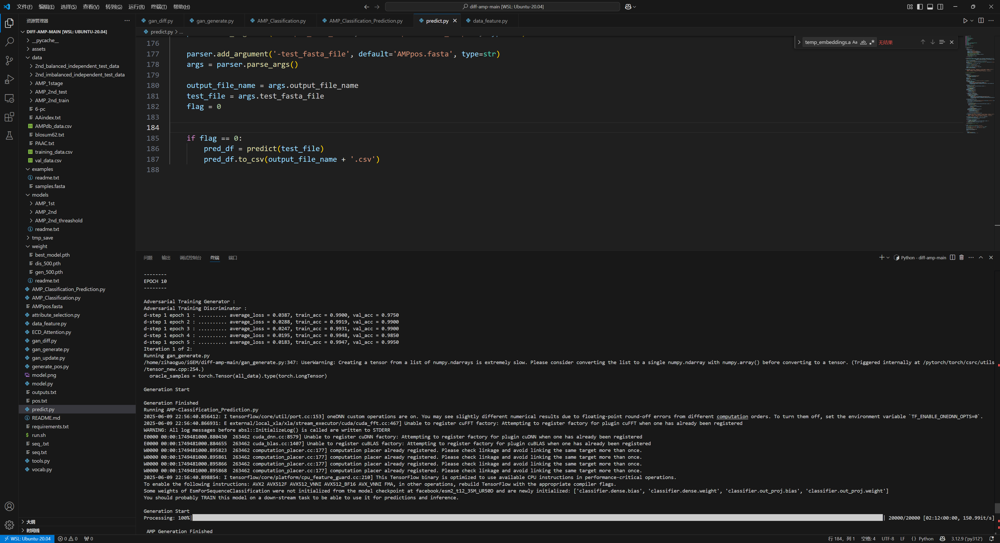

# Diff-AMP复现指南


# Diff-AMP: 抗菌肽（AMP）生成与预测模型

本项目是 Diff-AMP 模型的实现，一个用于生成、识别和优化抗菌肽 (Antimicrobial Peptides, AMPs) 的综合框架。

## 模型结构

模型结构图



## 环境配置与准备

为了方便复现，建议配置一个通用的 Python 环境。

1. **下载数据集**：
   - 生成模型 (Diff-RLGen) 和识别模型所需的数据集位于 `data` 目录下。
   - 多属性预测模型所需的数据集请从 [Google Drive 链接](https://www.google.com/search?q=https://drive.google.com/drive/folders/your_link_here) 下载，并解压到 `data` 目录下。
2. **下载预训练权重**：
   - 从 [Google Drive 链接](https://www.google.com/search?q=https://drive.google.com/drive/folders/your_link_here) 下载所有预训练权重。
   - 将生成和分类模型的权重文件 (`.pth`, `.ckpt` 等) 放入 `weight` 目录。
   - 将多属性预测模型的权重文件放入 `models` 目录。

## 使用说明

我们提供了三种核心模型的 Hugging Face 在线体验、训练和预测脚本。

### 1. 生成模型 (Generation Model)

- **在线体验**：[Diff-AMP Antimicrobial Peptide Generation](https://www.google.com/search?q=https://huggingface.co/spaces/your_space/diff-amp-generation)

- 模型训练

  ```
  python gan_diff.py
  ```

- 生成抗菌肽

  ```
  python gan_generate.py
  ```

  > **注意**：如需跳过训练直接生成，请确保已从上述链接下载预训练权重并放置在 `weight` 目录下。

### 2. 分类模型 (Classification Model)

- **在线体验**：[Diff-AMP AMP Sequence Detector](https://www.google.com/search?q=https://huggingface.co/spaces/your_space/diff-amp-detector)

- 模型训练

  ```
  python AMP_Classification.py
  ```

- 预测自定义序列

  1. 创建一个名为 `seq.txt` 的文件，每行包含一条肽序列。

  2. 运行以下命令进行预测：

     ```
     python AMP_Classification_Prediction.py
     ```

  > **注意**：如需使用预训练模型进行预测，请确保已下载相应权重并放置在 `weight` 目录下。

### 3. 多属性预测模型 (Multi-Attribute Prediction Model)

- **在线体验**：[Diff-AMP AMP Prediction Model](https://www.google.com/search?q=https://huggingface.co/spaces/your_space/diff-amp-prediction)

- 对生成的抗菌肽进行属性预测

  ```
  python predict.py
  ```

  > **注意**：运行前，请确保已从上述链接下载权重文件并放置在 `models` 目录下。

## 一键运行

您也可以使用 `run.sh` 脚本来体验从生成、识别到优化的完整流程。

```
bash run.sh
```

## 复现问题排查 ⚠️

在复现 `gan_generate.py` 脚本时，可能会遇到**自己训练的模型权重与网络结构不匹配**的问题，导致加载失败。

**解决方案**：

- **推荐**：直接使用作者提供的预训练权重，可以避免此问题。
- **高级**：如果坚持使用自己训练的权重，需要检查并修改网络结构代码，确保与权重文件完全匹配。

按照作者提供的gogle driver连接，配置好weight，models，data文件夹


Run `gan_diff.py`



Run `gan_generate.py`

遇到问题，自己训练的模型权重显示不匹配，要重新修改网络结构或者直接用作者提供的权重



最终运行结果


