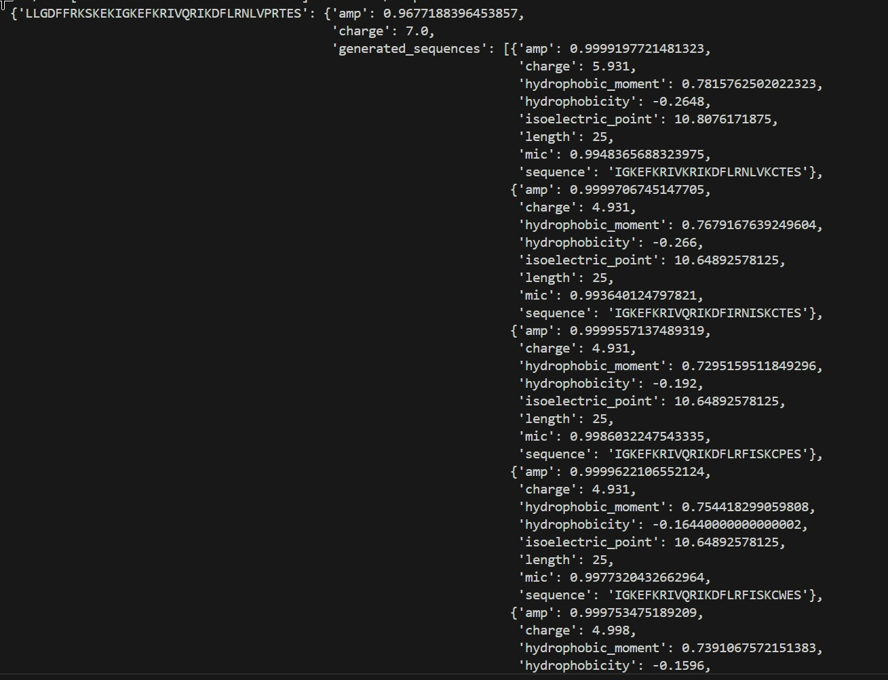

# Hydra-AMP 论文复现指南

本指南旨在帮助用户快速复现 Hydra-AMP 论文中的相关实验。

原始项目链接：https://github.com/szczurek-lab/hydramp

------

## 1. 环境配置 ⚙️

在开始之前，请确保您的开发环境满足以下要求。

### **1.1 数据准备**

我们提供了便捷的脚本来自动下载并配置所需的数据和模型文件。请在终端中运行以下命令：

Bash

```
bash ./get_data.sh
```

该脚本会自动下载并解压所有必需文件到相应目录。

### **1.2 依赖安装**

为避免版本冲突，强烈建议您创建一个新的 Python 虚拟环境。**本项目要求使用 Python 3.8 版本**，其他版本可能会导致不可预知的错误。

创建并激活新环境后，使用 `pip` 安装所有依赖项：

Bash

```
# 建议先创建并激活虚拟环境
# 然后运行以下命令安装相关包
pip install .
```

------

## 2. 模型推理 🚀

以下是如何使用预训练模型生成抗菌肽 (AMPs) 的示例。

### **2.1 生成类似物 (Analogue Generation)**

此模式根据您提供的现有抗菌肽序列，生成功能相似的变体。以 **LL-37** 肽为例，运行以下命令：

Bash

```
python -m amp.inference.scripts.run_analouge_generation \
    --model_path './downloaded_data_zips/models/HydrAMP/37' \
    --decomposer_path './downloaded_data_zips/models/HydrAMP/pca_decomposer.joblib' \
    --filtering-criteria 'improvement' \
    --temperature 1 \
    --sequences 'LLGDFFRKSKEKIGKEFKRIVQRIKDFLRNLVPRTES'
```

结果展示




### **2.2 无约束生成 (Unconstrained Generation)**

此模式用于从头生成全新的抗菌肽序列。其运行方式与类似物生成相似，请参考 `run_analouge_generation` 脚本的参数，并对 `run_unconstrained_generation` 脚本进行相应修改。

------

## 3. 注意事项与未来工作 📝

### **当前限制**

- **序列长度**：当前的预训练模型仅支持生成长度为 **25** 个氨基酸的抗菌肽。若需生成其他长度的序列，必须使用您自己的数据集重新进行训练。

### **未来工作**

- **代码重构**：该项目当前严重依赖于特定版本的 TensorFlow，这使得代码的修改和扩展变得困难。未来计划将核心代码迁移到 PyTorch 框架，以提高灵活性和易用性。